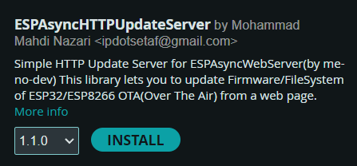
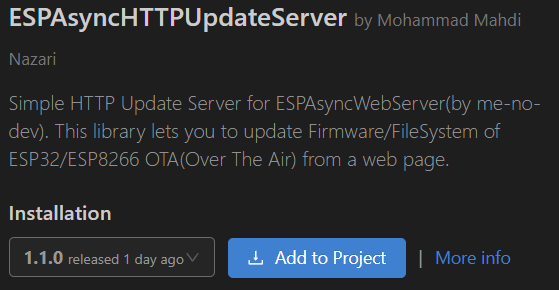
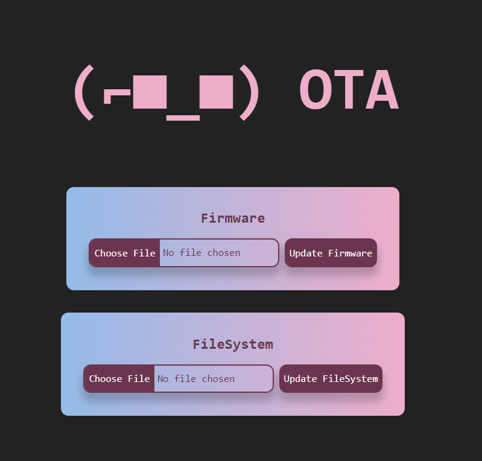
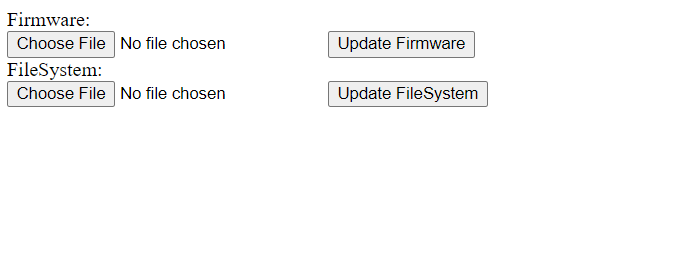

<p align=left>
   
   
   
   
   <!---->
</p>

# ESP Async HTTP Update Server

This is a copy of [ESP8266HTTPUpdateServer](https://github.com/esp8266/Arduino/tree/master/libraries/ESP8266HTTPUpdateServer)/[ESP32's HTTPUpdateServer](https://github.com/espressif/arduino-esp32/tree/master/libraries/HTTPUpdateServer) library, modified to be compatible with [ESPAsyncWebServer](https://github.com/me-no-dev/ESPAsyncWebServer).

It will provide a simple webpage for updating the firmware or filesystem of `ESP8266` or `ESP32` microcontrollers.

## Features
- Supports:
    - ESP8266
    - ESP32
- Can Update:
    - Firmware
    - FileSystem
- Styling:
    - Stylized (Additional ~350 bytes)
    - Minimal
- Update route customization (default: `/update`)
- Update credentials customization (default: `No credentials`)
    - Username
    - Password
- FileSystem Options:
    - SPIFFS
    - LittleFS

## HowTo

### Install

This Library is available in `Arduino Library Repository` and `PIO` and you can install it from: 
- Arduino IDE Library Manager
  


- PlatformIO Libraries



`ipdotsetaf/ESPAsyncHTTPUpdateServer@^1.1.0`
### Setup
1. Include the library after `ESPAsyncWebServer.h`
``` C++
#include <ESPAsyncWebServer.h>
#include <ESPAsyncHTTPUpdateServer.h>
```
2. Create an object from `ESPAsyncHTTPUpdateServer`
``` C++
ESPAsyncHTTPUpdateServer _updateServer;
AsyncWebServer _server(80);
```
3. Setup the update server before starting the webServer
``` C++
_updateServer.setup(&_server);
_server.begin();
``` 
#### Custom Route
``` C++
_updateServer.setup(&_server, "/customroute");
```
#### Credentials
``` C++
_updateServer.setup(&_server, "username", "password");
```
or
``` C++
_updateServer.setup(&_server, "/customroute", "username", "password");
```

### Styling
- Stylized


- Minimal


> [!IMPORTANT]
> By default styling is disabled in order to save ~350 bytes of flash memory.
>
> you can enable THE styling by adding the `-DESPASYNCHTTPUPDATESERVER_PRETTY` Build Flag to your environment.

### Selecting FileSystem
> [!IMPORTANT]
> The library's default fileSystem is `SPIFFS` but if you are using `LittleFS` for your FileSystem, make sure to add the `-DESPASYNCHTTPUPDATESERVER_LITTLEFS` Build Flag to your environment.

### Debugging
> [!TIP]
> In order to debug the library functionality, you can add the `-DESPASYNCHTTPUPDATESERVER_DEBUG` Build Flag to your environment.
>
> This will enable the library to print logs to the Serial.

> [!TIP]
> If you are using another `Serial` port, you can override the default serial by adding the `-DESPASYNCHTTPUPDATESERVER_SerialOutput=Serial1` Build Flag to your environment.

## TODO:
- Optional Page Styling

## Contribution
- You can open Issues for any bug report or feature request.
- You are free to contribute to this project by following these steps:
   1. Fork this Repo.
   2. Create a new branch for your feature/bugfix in your forked Repo.
   3. Commit your changes to the new branch you just made.
   4. Create a pull request from your branch into the `master` branch of This Repo([https://github.com/IPdotSetAF/ESPAsyncHTTPUpdateServer](https://github.com/IPdotSetAF/ESPAsyncHTTPUpdateServer)).
